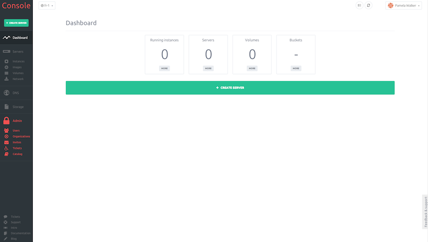
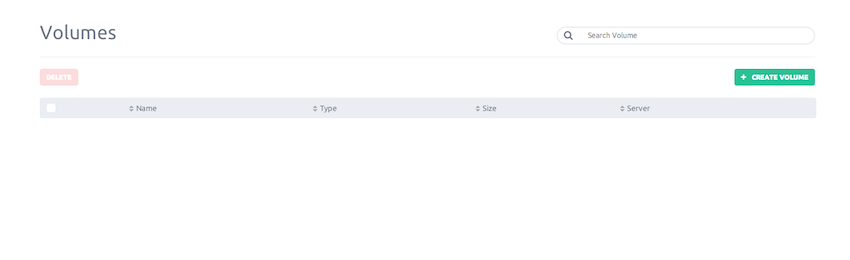

It could happen that you need to add more storage to your existing instances.
We allow you to attach more storage volume to an existing instance.

This guide gonna show you how to create and attach additional volume to an existing instance

#### Step 1 - Volumes

From the console, on the left side panel go to the volumes section

You will be asked to create a new volumes if you still don't have create one, or the list of existing volumes will be shown.

To create a new volume, simply click on "Create new volume" button.

Then you will be ask to choose if you wish to "Create new volume" or "Create from existing volume".

#### Step 2 - Create new volume

Volume creation occured in 3 steps :

- Name your volume

- Set the volume size (must be at least 1Gb and can't exceed 1Tb)

- Select the volume type

  - Scalable distributed storage - 99.999% availability and 99.999% reliability over a year, sustain the loss of data in 200+ data centers. recommended for high redundancy.

  - Ultra low latency - SSD disk to deliver faster disk I/O performance, it's perfect if you need heavy read/write

#### Step 4 - Create from existing volume

The process is the same that explain in step3, difference is that you don't have to set a size for the volume but must choose a  snapshot form previous one.

#### Step 5

Well, you are now on your volume details page, just click "More" button, attach.

A popin show you the list of servers you own, select the instance you attach the volume and it's done!

