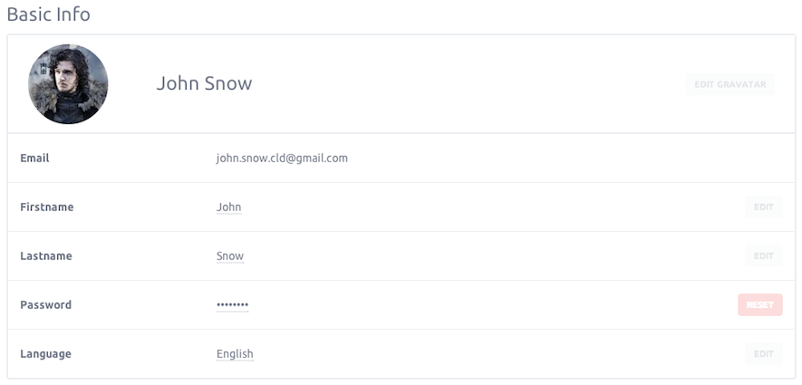
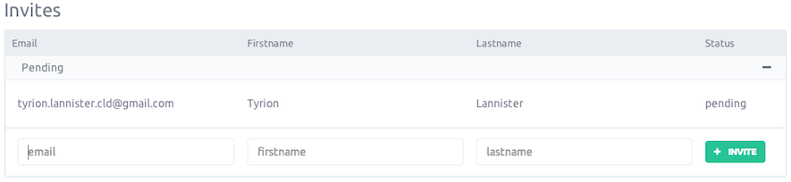

### Account settings

Has it can happen, you may want to update some of your personnal information.
In your account section, you can edit the following informations

- Avatar
- Email
- Firstname
- Lastname
- Password
- Language

### Invitations

Since we are in BETA, each active account owns 5 invitations that you can send to people of your choice.
To invite a new person to the service, go to the account section of your account.

Then in the Invitations section, just add email, firstname and lastname of the personn to invite and click "Invite" button.
The invitation get the pending status while our teams validate it.

### Quotas

Each user account have limitation on resource creation, at this time you have the avaibality to create:

- 2 servers
- 6 volumes
- 10 snapshots
- 10 images
- 1 reserved ip
