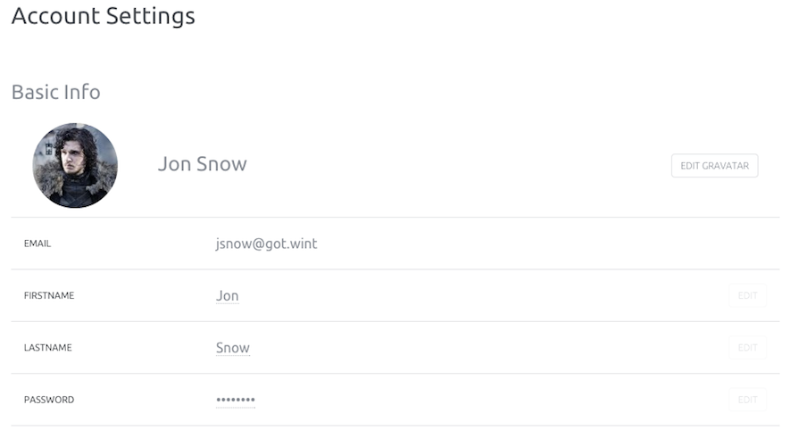

This page shows you how to edit your account settings and send invitations.

### Account settings

In your account section you can edit the following informations.

- Avatar
- Firstname
- Lastname
- Password
- Language

In the Control Panel, open the pull-down menu on your account name and click on "My account" link.

.

You will land on a page like this.

### Invitations

We offer you five invitations to invite your friend to the Online Labs preview. 
To invite a new person to the service, open the pull-down menu on your account name and click on "My account" link.

In the invitations section add email, firstname and lastname of the personn to invite and click on "Invite" button.

The invitation will the status "pending" (last column in the previous screenshot) while our team validate your invite.

### Quotas

Each user account is limited to:

- 2 servers
- 6 volumes
- 10 snapshots
- 10 images
- 1 reserved IP address
