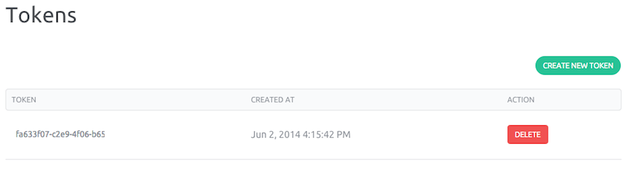

This page shows you how to deal with credentials and how to get your token.

Credential allow you to interact with our [APIs](//doc.cloud.online.net/api/).

A token is a unique alphanumeric identifier associated with your account and is used to authenticate commands for all of your services.

Open the pull down menu on your account name and click on "My credentials" link.

Here you can create a new token by clicking the "Create New Token button", are also displayed the list of active tokens. 
Now that you have generat your Token, you are able to authenticate and use the API

At any time you can delete a Token by clicking the "Delete" button