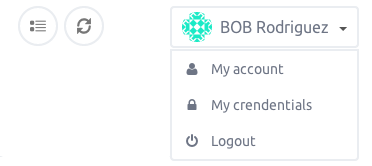

When you create a new instance, you receive an email as soon as your instance is up, giving you the instance password and IP address. 
This pratice is heavy and convenient, but there's more a secure and lightest method available `key pair authentication`

This article is intended to guide you to use SSH key pair authentication to connect a new instance.

### Step 1 - Create the RSA Key Pair

- Open a terminal
- Generate a new key typing the following command `ssh-keygen -t rsa`
- Give a name to your key `Enter file in which to save the key (/Users/me/.ssh/id_rsa):` if you don't default name will be id_rsa
- Set a passphrase `Enter passphrase (empty for no passphrase):` this step is not mandatory but highly recommanded
- Your key has been generate, in my case it has default name id_rsa and is located in `/Users/me/.ssh/` directory

The public key is named id_rsa.pub 
The privated key is named id_rsa


The entire key generation looks like this

```
ssh-keygen -t rsa

Generating public/private rsa key pair.
Enter file in which to save the key (/Users/me/.ssh/id_rsa):
Enter passphrase (empty for no passphrase):
Enter same passphrase again:
Your identification has been saved in /Users/me/.ssh/id_rsa.
Your public key has been saved in /Users/me/.ssh/id_rsa.pub.
The key fingerprint is:
12:93:cc:c1:5b:76:4f:b6:b9:b4:65:b0:33:8b:f1:59 me@localhost
The key's randomart image is:
+--[ RSA 2048]----+
|     ..          |
|     o.oo . +    |
|      *+ . + =   |
|      .o  . O E  |
|      . S  = @   |
|       .  . *    |
|                 |
|                 |
|                 |
+-----------------+
```

### Step 2 - Copy the public Key on the console

Once you have create your ssh KEY, you have to add it into the console.

- Copy your public key

```
cat /Users/me/.ssh/id_rsa.pub

ssh-rsa AAAAB3NzaC1yc2EAAAADAQABAAABAQD3TsFepMvwNBIjsr3Zr85mj/Aho/tk3220ryzVxgxR44EWz9xe8YhUt0Tg08e4pHns8DV6UnGwDeGLtxNwSFZlh1Zox3jACHL2dId04NAjLno1MsddByudPB7UpRu+nUjN7b8/rIAjXNu4k7H+E1QEz8P7giPiql2YMxURO9TV0tbl4M9hNG0/S6ka/naF8pIUnz7Um1nHGiBsMh9IyJAMhdWJ1nN3p1dnG3ixvyf1Mb8+7sbHjRgdUA3L8/HTBOCp+twB9uG+GfFEdheyHcnbxdtkByLzx2GbEnLNZZ99pF9i/cdpcaWCpnnqf/6TNVpFyCWhSfBq8+4OKUHt5vDB me@localhost
```
- From the dashboard, select my account



- On the SSH Keys section paste your public key in the text area


- Save it by clicking New SSH Key button


### Step 3 - Create a new instance

Create a new server from the "Create Server" in the console. At the moment the keys you add will be set on the instance

### Step 4 - Connect to your server

Once you server is reasy, you can connect to it like you did previously

`ssh root@w.x.y.z`