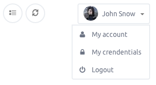
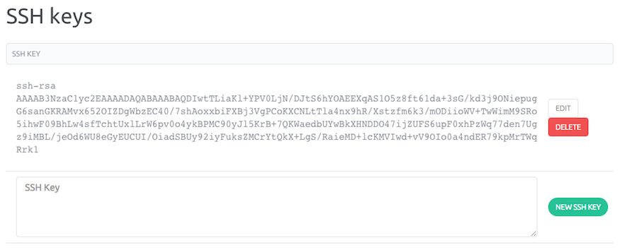

This page shows you how to create and enable SSH Keys.

Before connecting to your servers, you must set an existing public Key to your account. If you already have an SSH Key skip Step 1.

### Step 1 - Create the RSA Key Pair

- Open a terminal
- Generate a new Key typing the following command `ssh-keygen -t rsa`
- Give a name to your Key `Enter file in which to save the key (/Users/me/.ssh/id_rsa):` otherwise, the default name will be id_rsa
- Set a passphrase `Enter passphrase (empty for no passphrase):` this step is not mandatory but highly recommended
- You should now have two files for your Key (a public key that we will copy on your servers, and a private key that you must keep secret), in our example the two files are located in the `/Users/me/.ssh/` directory
 
The public Key is named id_rsa.pub 
The private Key is named id_rsa

The entire key generation looks like this

```
ssh-keygen -t rsa

Generating public/private rsa key pair.
Enter file in which to save the key (/Users/me/.ssh/id_rsa):
Enter passphrase (empty for no passphrase):
Enter same passphrase again:
Your identification has been saved in /Users/me/.ssh/id_rsa.
Your public key has been saved in /Users/me/.ssh/id_rsa.pub.
The key fingerprint is:
12:93:cc:c1:5b:76:4f:b6:b9:b4:65:b0:33:8b:f1:59 me@localhost
The key's randomart image is:
+--[ RSA 2048]----+
|     ..          |
|     o.oo . +    |
|      *+ . + =   |
|      .o  . O E  |
|      . S  = @   |
|       .  . *    |
|                 |
|                 |
|                 |
+-----------------+
```

### Step 2 - Save the content of the public Key on the SSH Keys section

Once your SSH Key is ready, you now must save the content of the public Key in the Control Panel.

- Copy your public key

```
cat /Users/me/.ssh/id_rsa.pub

ssh-rsa AAAAB3NzaC1yc2EAAAADAQABAAABAQD3TsFepMvwNBIjsr3Zr85mj/Aho/tk3220ryzVxgxR44EWz9xe8YhUt0Tg08e4pHns8DV6UnGwDeGLtxNwSFZlh1Zox3jACHL2dId04NAjLno1MsddByudPB7UpRu+nUjN7b8/rIAjXNu4k7H+E1QEz8P7giPiql2YMxURO9TV0tbl4M9hNG0/S6ka/naF8pIUnz7Um1nHGiBsMh9IyJAMhdWJ1nN3p1dnG3ixvyf1Mb8+7sbHjRgdUA3L8/HTBOCp+twB9uG+GfFEdheyHcnbxdtkByLzx2GbEnLNZZ99pF9i/cdpcaWCpnnqf/6TNVpFyCWhSfBq8+4OKUHt5vDB
```
- From the Control Panel, open the pull-down menu on your account name and click on "Credentials" link.



- In the SSH Keys section paste the content of your public key in the text area and click on "New SSH Key" button.



