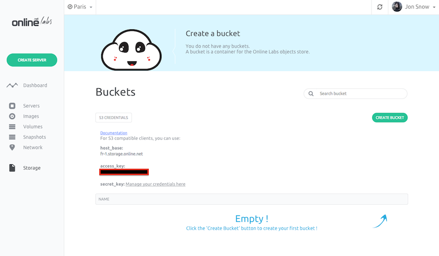
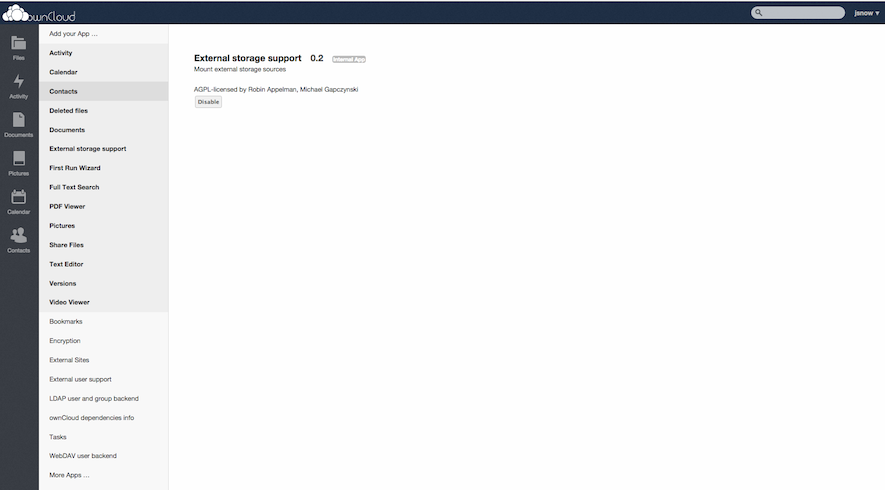
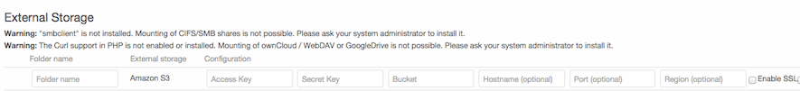

This page shows you how to spawn an Owncloud application with Object Storage.

> <strong>Requirements</strong>
>
- You have an account and are logged into [cloud.online.net](//cloud.online.net)
- You have configured your [SSH Key](/howto/ssh_keys.html)
- You have generate your [API Token](/howto/credentials.html)

> <strong>The Owncloud application comes with the following packages</strong> :
```
mysql-server,owncloud,pwgen
```


With ownCloud you can sync & share your files, calendar, contacts and more.
Access your data from all your devices, on an open platform you can extend and modify.

There are two steps to deploy the Owncloud application

- [Deploy Owncloud](/applications/owncloud.html#step-1-deploy-owncloud)
- [Configure Owncloud](/applications/owncloud.html#step-2-configure-owncloud)
- [Login and start using Owncloud](/applications/owncloud.html#step-3-login-and-start-using-owncloud)
- [Configure Owncloud with Object Storage](/applications/owncloud.html#step-4-configure-owncloud-with-cloud-storage)


Before starting, click the "Create Server" button in the control panel.


### Step 1 - Deploy Owncloud

You will land on the server-creation page where you must input basic information for your server:

- The name of your server
- The tag you want to assign to it (Optional). Tags let you organize your servers, you can assign any tag to each server.


After inputting your server basic information, you have to choose a starting application for your server.<br />
On the Applications tab, select Owncloud. The server will be created with a ready to use Owncloud.


Click the "Create Server" button. This action starts your server.
In a few seconds, the Owncloud application will be ready to use.

### Step 2 - Configure Owncloud

When your server is running, you can see the server's IP address in the server list on the control panel. Copy this IP address and paste it in your favorite browser.


You land on the Owncloud configuration page.


Fill-in the admin account with your username and password.

Owncloud uses a MySQL database. To retrieve the database credentials, connect your server using a terminal `ssh root@<your_server_ip>`.<br />
If you are not familiar with ssh, you can read the following documentation: [Log-into your server](/howto/create_instance.html#log-into-your-server)

In the root directory of your server, execute the following command `cat .my.cnf`. It will display your database credential (user and password).

```
root@c1-X-Y-Z-T:~#cat .my.cnf
[client]
user = root
password = chalapookeechooquailaizaexareiyughieriofoo
```

In the Owncloud setup, fill-in the database user and password you retrieve from the `.my.cnf` file.<br />Set the database name to `owncloud` and click the "Finish Setup" button.

### Step 3 - Login and start using Owncloud

Owncloud is now installed and ready to use.


### Step 4 - Configure Owncloud with Object Storage

Before starting, click the "Storage" button in the Online Labs control panel.
You will land on the Storage page.

The first thing to do is to create a new bucket for Owncloud to store files inside.<br/>
A bucket name must contain only alphanumeric and lowercase characters

Then, click on the "S3 Credentials" button.<br/>
The credentials required to access Object Storage are displayed:

- `host_base`  base url to access Object Storage service
- `access_key` the access key required for Object Storage 
- `secret_key` the API Token you generated previously.




On the bottom of the left panel click the "Apps" button. Select `External storage support` application and set it to "Enable".




On the admin panel, create a new folder for Object Storage and configure it




Select "Amazon S3" as External storage and fill-in with your S3 credential.

- Folder name
- Access Key: your `access key`
- Secret Key: your `secret_key`
- Bucket: The name of the bucket you created
- Hostname: `host_base`
- Enable SSL

You now have a new foler using Object Storage that allow you to have an highly available and unilimited storage.


