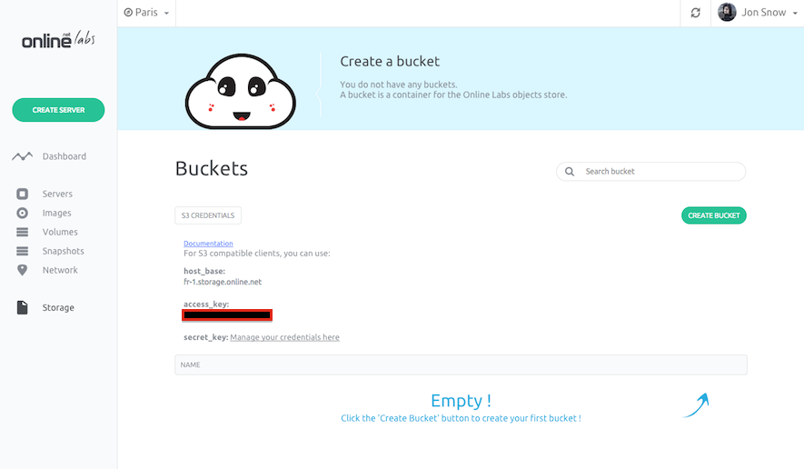
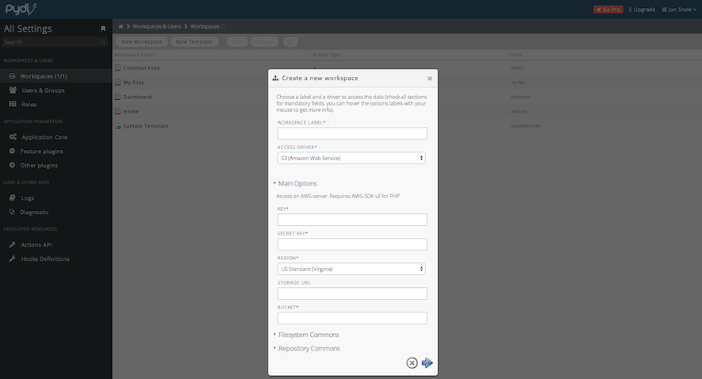

This page shows you how to spawn a Pydio application with Cloud Storage.

> <strong>Requirements</strong>
>
- You have an account and are logged into [cloud.online.net](//cloud.online.net)
- You have configured your [SSH Key](/howto/ssh_keys.html)
- You have generate your [API Token](/howto/credentials.html)

> <strong>The Pydio application comes with the following packages</strong> :
```
libapache2-mod-php5,php5-cgi,php5,apache2,php5-gd,php5-mcrypt,php5-cli,php5-mysqlnd,pwgen,php5-curl,mysql-server
```

Pydio is an open source software solution for file sharing and synchronization. With intuitive user interfaces (web / mobile / desktop).

The Pydio application will store files in our Cloud Storage thereby you have an highly available and unilimited storage.

There are two steps to deploy the Pydio application

- [Deploy Pydio](/applications/pydio.html#step-1-deploy-pydio)
- [Configure Pydio](/applications/pydio.html#step-2-configure-pydio)
- [Login and start using Pydio](/applications/pydio.html#step-3-login-and-start-using-pydio)
- [Configure Pydio with Cloud Storage](/applications/pydio.html#step-4-configure-pydio-with-cloud-storage)


### Step 1 - Deploy Pydio

Before starting, click the "Create Server" button in the control panel.


You will land on the server-creation page where you must input basic information for your server:

- The name of your server
- The tag you want to assign to it (Optional). Tags let you organize your servers, you can assign any tag to each server.


After inputting your server basic information, you have to choose a starting application for your server.<br />
On the Applications tab, select Pydio. The server will be created with a ready to use Pydio.

Click the "Create Server" button. This action starts your server.
In a few seconds, the Pydio application will be ready to use.

### Step 2 - Configure Pydio

When your server is running, you can see the server's IP address in the server list on the control panel. Copy this IP address and paste it in your favorite browser.


You land on the Pydio diagnostic page. All checks are "OK" except the SSL encryption which is disabled.


Click on the "click here to continue to Pydio." link to continue the installation.

You are asked to fill-in:

#### The admin access


#### The global options


#### The configuration storage

Pydio uses a MySQL database as configuration storage. To retrieve the database credentials, connect your server using a terminal `ssh root@<your_server_ip>`.<br />
If you are not familiar with ssh, you can read the following documentation: [Log-into your server](/howto/create_instance.html#log-into-your-server)

In the root directory of your server, execute the following command `cat .my.cnf`. It will display your database credential (user and password).

```
root@c1-X-Y-Z-T:~#cat .my.cnf
[client]
user = root
password = ootaitevohxeizasinaeguasofaiwiuzuekohbicut
```

In the Pydio setup wizard, fill-in the database user and password you retrieve from the `.my.cnf` file and click the "Install Pydio Now" button
 


### Step 3 - Login and start using Pydio

Pydio is now installed and ready to use. Input the username and password you set during the configuration and login


### Step 4 - Configure Pydio with Cloud Storage

Before starting, click the "Storage" button in the Online Labs control panel.
You will land on the Storage page.

The first thing to do is to create a new bucket for Pydio to store files inside.<br/>
A bucket name must contain only alphanumeric and lowercase characters

Then, click on the "S3 Credentials" button.<br/>
The credentials required to access Cloud Storage are displayed:

- `host_base`  base url to access Cloud Storage service
- `access_key` the access key required for Cloud Storage 
- `secret_key` the API Token you generated previously.




On the left panel of Pydio settings, click Workspaces and New Workspace. Select "S3 Amazon Web Service" as driver and fill-in with your S3 credential.

- KEY: your `access key`
- SECRET KEY: your `secret_key`
- STORAGE URL: `https://fr-1.storage.online.net`
- BUCKET: The name of the bucket you created

When you have filled all inputs, submit.



You now have a new workspace using Cloud Storage that allow you to have an highly available and unilimited storage.


