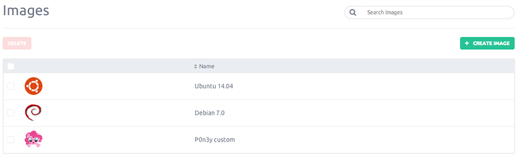
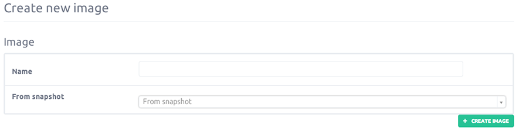

Images are really use full if you want to clone an instance to another or to publish an instance image to the market place.

This article will guide you through the process of creating an image from the console.

### Potential Uses

- Duplicate Server
- Automate Server Builds
- Create a Software Testing Environment

###Step 1 - Create image from a volume snapshot

Click on the "Images button on left-side menu, you will arrive on your images list. Here are displayed the list of images available, to create a new one click the "Create image" button

### Step 2 - Image creation

You are now asked for:

- Giving an image name

- Choose the volume snapshot you want to use for your image

Once achieve, click on "Create Image." In the minutes that follows, your image will be set up and ready to use.

### Coming soon

- No reboot - Instance image is create without rebooting your server
- Market place image - Image will be available publicly on the Image Market Place, by default, image are not published to the market place.
- Create an image directly from an instance
