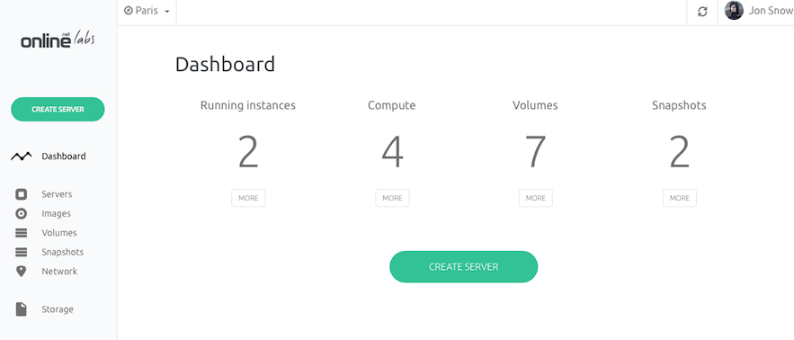
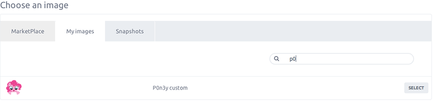

Images are really useful if you want to clone an instance to another or to publish an instance image to the market place.

This article will guide you through the process of restoring an instance from an image.

### Step 1 - Create a new server

From, the dashboard, click the Create Server button.

You land on the instance creation section and have to set basic informations for your server: 

- The name of your instance
- The tags you want to assign on it.

### Step 2 - Select an image

On the instance settings page, you are asked to select an image, from the choose an image section

### Step 3 - Launch instance

Launch it, in few minutes your instance based on the selected image will appear on your server list.
