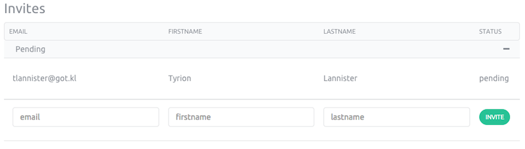

This page shows you how to edit your account settings and send invitations.

## Account settings

In your account section you can edit your personnal informations.
In the console, open the pull-down menu on your account name in the righ top
corner and click on the "Account" link.

.

You will land on a page looking like this.

## Invitations

You have five invitations to invite your friend to this preview and to spread
this innovation worldwide. 
To invite a new person to the service, open the pull-down menu on your account
name in the right top corner and click on the "Account" link.

In the "invites" section, add the email, firstname and lastname of the person
you want to invite and click on the "Invite" button.
The status will be "pending" (last column in the previous
screenshot) until our team validates your invite.
