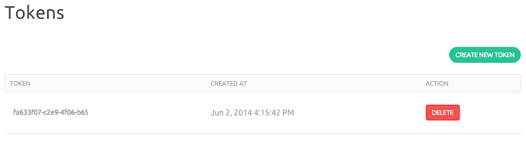

><strong>Security information:</strong> API tokens are like password, they allow total
access to your account, do no share them! If you believe one of your tokens was
compromised, delete it and create a new one.

Before you can start using our API, you will need to get an API token.
This page shows you how to get one and how to use it to authenticate against our API.

API tokens are unique identifier associated with your account. We use them
to authenticate commands in our [API](//doc.cloud.online.net/api/).


- Open the pull-down menu on your account name and click on "My credentials" link.


- To generate a new token, click "Create New Token" on the top right corner.



- Execute a command through our API (e.g. List your servers) with your API Token 

```
curl -H "X-Auth-Token: 1bdeff81-ff0a-477d-8f7f-8be89e06ed12" https://api.cloud.online.net/servers
{
  "servers": [
    {
      "dynamic_public_ip": false,
      "id": "37b7c1eb-2625-4180-9091-a8d354ec679f",
      "image": {
        "id": "bdf69744-5e87-41be-a9fb-8ddade2e3da1",
        "name": "Ubuntu Trusty (14.04) on SSD"
      },
      "name": "labs-701afc",
      "organization": "000a115d-2852-4b0a-9ce8-47f1134ba95a",
      "private_ip": "10.1.5.15",
      "public_ip": {
        "address": "212.47.226.35",
        "dynamic": true,
        "id": "d096928f-9d14-4c21-8812-6cbce97e662a"
      },
      "state": "running",
      "tags": [
        "www",
        "prd"
      ],
      "volumes": {
        "0": {
          "export_uri": "nbd://10.1.5.29:4256",
          "id": "b0bbd0a6-603e-4504-b9bd-0c5e39b159d8",
          "name": "Ubuntu Trusty (14.04) SSD Root snapshot",
          "organization": "000a115d-2852-4b0a-9ce8-47f1134ba95a",
          "server": {
            "id": "37b7c1eb-2625-4180-9091-a8d354ec679f",
            "name": "labs-701afc"
          },
          "size": 25000000000,
          "volume_type": "l_ssd"
        }
      }
    }
  ]
}
```

