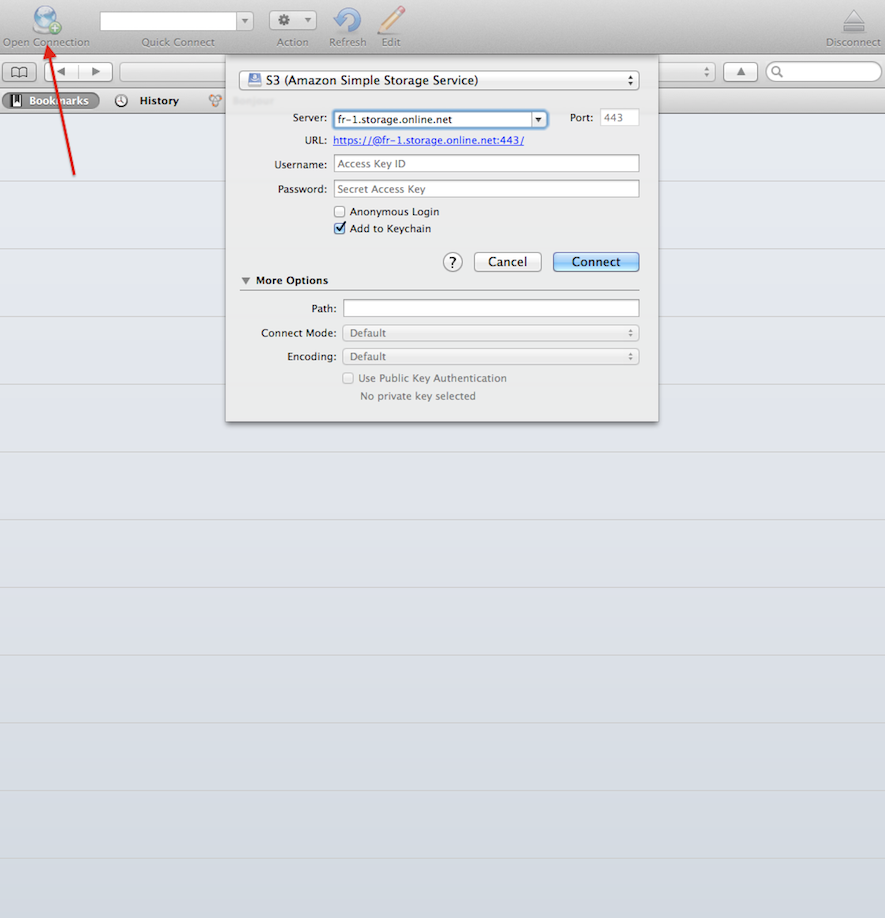

This page shows you how to store object with Cyberduck.

> <strong>Requirements</strong>
- You have an account and are logged into [cloud.online.net](//cloud.online.net)
- You have generate your [API Token](/account/credentials.html)

Cloud Storage allows you to store any kind of object (documents, images, videos, etc.) and retrieve them at a later time from anywhere

For instance, you can store images and they will be accessible using HTTP.
You can use the control panel to manage your storage. Some tools exist to interact with cloud storage.

This guide will show you how to use Cloud Storage with one of these tools, Cyberduck. 
There are four steps to configure and use Cloud Storage with Cyberduck

- [Retrieve S3 Credentials](/howto/s3.html#step-1-retrieve-s3-credentials)
- [Download Cyberduck](/howto/s3.html#step-2-download-s3cmd)
- [Configure Cyberduck](/howto/s3.html#step-3-configure-s3cmd)

### Step 1 - Retrieve S3 Credentials

Before starting, click the "Storage" button in the control panel.

You will land on the Storage page. Then, click on the "S3 Credentials" button. 
The credentials required to access Cloud Storage are displayed:

- `host_base`  base url to access Cloud Storage service
- `access_key` the access key required for Cloud Storage 
- `secret_key` the API Token you generated previously.

### Step 2 - Download Cyberduck

A simple solution to begin with Cloud Storage is to use the Cyberduck tool, which is a graphical client for S3 Cloud Storage.

Cyberduck allows you to create, list and delete buckets, download, upload, and delete objects inside the Cloud Storage.
First, you need to download [Cyberduck](https://cyberduck.io/).

### Step 3 - Configure Cyberduck

We will configure Cyberduck to work with Cloud Storage.
The following is basic configuration example to use Cloud Storage with Cyberduck.

In Cyberduck window, click <strong>Open Connection</strong> and select `S3 (Amazon Simple Storage Service)`. 
Set the server url to `fr-1.storage.online.net` and replace `<Access Key ID>` and `<Secret Access Key>` with your credentials.

You can now create a bucket and store objects inside. 
A bucket name must contain only alphanumeric and lowercase characters

