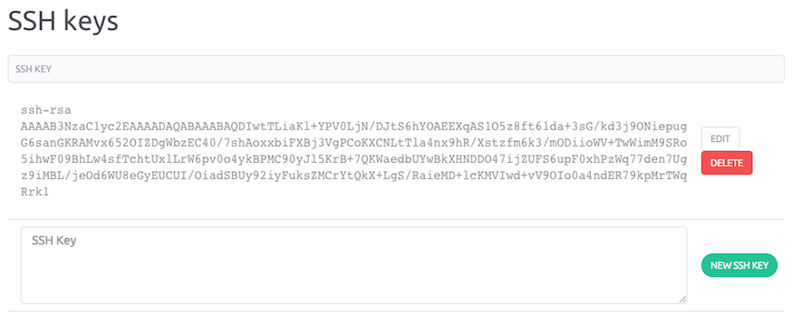

This page shows you how to create and enable SSH Keys.

> <strong>Important</strong>
- If you add a new SSH key into the console and can ssh your server, reload your ssh-keys with `service ssh-keys start` command
- If you add a new SSH key into the console and can not access your server, reboot your server from the Control Panel to load ssh-keys

Before connecting to your servers, you must set an existing public Key to your account. If you already have an SSH Key skip Step 1.

### Step 1 - Create the RSA Key Pair

- [On OSX and Linux](/howto/ssh_keys.html#on-osx-and-linux)
- [On Windows](/howto/ssh_keys.html#on-windows)

#### On OSX and Linux

- Open a terminal
- Generate a new Key typing the following command `ssh-keygen -t rsa`
- Give a name to your Key `Enter file in which to save the key (/Users/me/.ssh/id_rsa):` otherwise, the default name will be id\_rsa
- Set a passphrase `Enter passphrase (empty for no passphrase):` this step is not mandatory but highly recommended
- You should now have two files for your Key (a public key that we will copy on your servers, and a private key that you must keep secret), in our example the two files are located in the `/Users/me/.ssh/` directory
 
The public Key is named id\_rsa.pub 
The private Key is named id\_rsa

The entire key generation looks like this

```
ssh-keygen -t rsa

Generating public/private rsa key pair.
Enter file in which to save the key (/Users/me/.ssh/id_rsa):
Enter passphrase (empty for no passphrase):
Enter same passphrase again:
Your identification has been saved in /Users/me/.ssh/id_rsa.
Your public key has been saved in /Users/me/.ssh/id_rsa.pub.
The key fingerprint is:
12:93:cc:c1:5b:76:4f:b6:b9:b4:65:b0:33:8b:f1:59 me@localhost
The key's randomart image is:
+--[ RSA 2048]----+
|     ..          |
|     o.oo . +    |
|      *+ . + =   |
|      .o  . O E  |
|      . S  = @   |
|       .  . *    |
|                 |
|                 |
|                 |
+-----------------+
```

- Copy your public key content which is required for step 2

```
cat /Users/me/.ssh/id_rsa.pub

ssh-rsa AAAAB3NzaC1yc2EAAAADAQABAAABAQD3TsFepMvwNBIjsr3Zr85mj/Aho/tk3220ryzVxgxR44EWz9xe8YhUt0Tg08e4pHns8DV6UnGwDeGLtxNwSFZlh1Zox3jACHL2dId04NAjLno1MsddByudPB7UpRu+nUjN7b8/rIAjXNu4k7H+E1QEz8P7giPiql2YMxURO9TV0tbl4M9hNG0/S6ka/naF8pIUnz7Um1nHGiBsMh9IyJAMhdWJ1nN3p1dnG3ixvyf1Mb8+7sbHjRgdUA3L8/HTBOCp+twB9uG+GfFEdheyHcnbxdtkByLzx2GbEnLNZZ99pF9i/cdpcaWCpnnqf/6TNVpFyCWhSfBq8+4OKUHt5vDB
```

#### On windows

- Download [PuTTYgen](http://www.chiark.greenend.org.uk/~sgtatham/putty/download.html)
- Launch PuTTYgen
- Select SSH-2 RSA and click the "Generate" button


- Two keys are generated (a public key that we will copy on your servers, and a private key that you must keep secret)
- Fill-in the `Key-comment` field with a name to help you identify this key pair
- Click the "Save public key" button and save it in the folder of your choice
- Click the "Save private key" button  and save it the same folder
- Select the public key content. Copy it (below "Public key for pasting into OpenSSH authorized\_keys file") into your clipboard which is required for step 2


### Step 2 - Save the content of the public Key on the SSH Keys section

You now must save the content of the public Key in the Control Panel.

- From the Control Panel, open the pull-down menu on your account name and click on "Credentials" link.


- In the SSH Keys section paste the content of your public key in the text area and click on "New SSH Key" button.




You are now ready to [provision your first server](/howto/create_instance.html)
