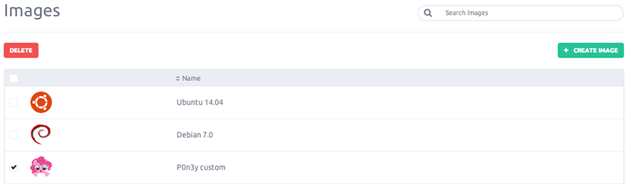

This documentation will guide you through the process of deleting an image.

### Delete an image

From the left-side menu click the "Images" button.

The list of images will appear, then just select the image you want to delete by clicking "Delete" on the sub-menu.

You are asked to confirm the deletion of the image, once confirmed the image will be delete.

