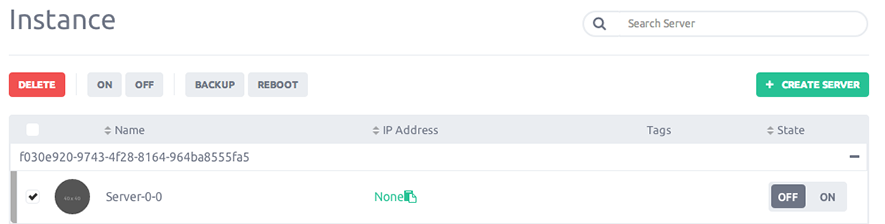

After you've finished with an instance, you should clean up.
The following procedure is intended to help you to delete an instance.

Click on the "Instances” button on left-side menu, you will arrive on your instances list.

### Step 1 - Instance deleting

Choose in the instances list the instance you want to terminate and click "Delete".
Then just confirm the instance removing.

Your instance will be removed instantly and billing will be interrupt.