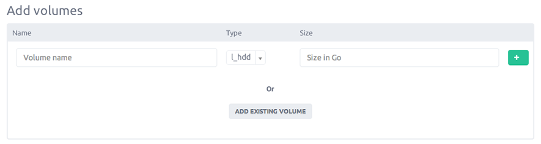

Each instance that you create is a physical server dedicated for your personal use. 
After you've launched your instance, you can connect and use it.

The following procedure is intended to help you to launch an instance in seconds.

### Step 1 - Name & Tags your instance

From, the dashboard, click the Create Server button.

You land on the instance creation section and have to set basic informations for your server: The name of your instance, the tags you want to assign on it.

Tags help you to manage your instances, and other resources, you can assign your own tags to each resource.

### Step 2 - Choose your image

Since you have set instance basic informations, you have to choose which image your instance will use. You can choose from

- Images: They are standard OS Images, we propose today some Linux operating systems, such as Ubuntu, Fedora or Debian... What else ? (list is update permanently).

- Market place: This section provide you custom images build by the community, they often run with pre-installed or configured services that will allow save you time.

- Snapshots: It's the list of your instance snapshots, it allow you to start a new instance form a previous one. 

### Step 3 - Add storage

You have to add at least one volume to your instance, it can be an existing volume or new one. 
An existing volume is a [snapshot](/servers/volumes/snapshot.html) that you take previously.

Volume size is limit to 1Tb and there is no limit on the amount of volumes you can attach to your server.

Your volume can be of type :

- Low latency Local storage on spinning disk, use for moderate read/write access

- Ultra low latency SSD disk to deliver faster disk I/O performance, it's perfect if you need heavy read/write

### Step 4 - Create your server

Well, it's now time to start your instance, just click the "Create server" button. In few seconds your instance will be ready to use.

If you have not configured your ssh key, you will receive an email with the root password.