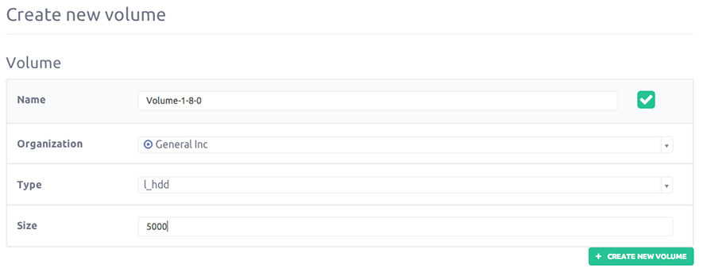
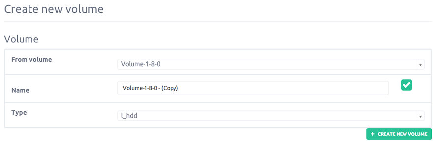
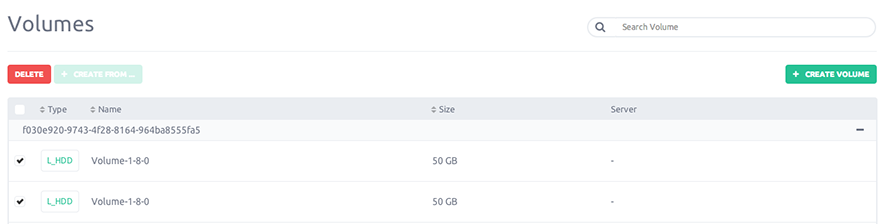

You can add extra storage on a running instance by adding volumes to an existing server.
A volume is at most attach to one instance.

This guide is about volumes management

### Creating new volume

#### Step 1

Choose if you want to "Create new volume" or "Create from existing volume".

- Create new volume - Create a volume from scratch

- Create from existing volume - Create from a snapshot volume [See volume snapshot documentation](/servers/volumes/snapshot.html)

#### Step 2 - Create new volume

Volume creation occurred in 3 steps :

- Name your volume

- Set the volume size (must be at least 1Gb and can't exceed 1Tb)

- Choose your volume type

  - Low latency Local storage on spinning disk, use for moderate read/write access

  - Ultra low latency SSD disk to deliver faster disk I/O performance, it's perfect if you need heavy read/write

#### Step 3 - Create from existing volume

The process is the same that explain in step 2, difference is that you don't have to set a size for the volume but must choose a  snapshot form previous one.

### Attach a volume

Since your volume is created, you will need to attach it to a specific instance.

From the volumes list, select the volume to attach and click the button "Attach", a pop-up appear asking on which instance you want to attach.

Once selected, just submit your choice.

### Detach a volume

If you want to detach a volume used by an instance, turn off the specific instance and go to the Volumes menu.

On the list, select the volume you want to detach, attached volumes have a server name not blank in the `Server` column.

Then select the volume to detach and click the "Detach" button.

### Delete

A volume is unused and you don't still need it ?

From the volumes list, select the volume to delete and click "Delete selected" button.

